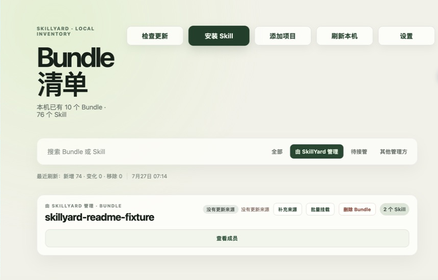

# SkillYard

SkillYard is a local-first macOS app for organizing, installing, taking over, mounting, and updating AI Agent Skills as Bundles.

[中文](./README.md) | English

## Download and requirements

[Download SkillYard 1.0.0](https://github.com/ReyYang/SkillYard/releases/tag/v1.0.0)

SkillYard 1.0 supports:

- macOS 14 Sonoma or later;
- Apple Silicon (`arm64`) Macs;
- the local Skill directories used by Codex, Claude Code, and GitHub Copilot.

Download `SkillYard-1.0.0-macos-aarch64.zip` from the Release. Unzip the archive, move `SkillYard.app` to `/Applications`, and launch it. The current build uses ad-hoc signing and is not notarized by Apple, so macOS may show a security prompt the first time it opens. Control-click the app in Finder and choose **Open**, or confirm the app under **System Settings → Privacy & Security**. Download official builds only from this repository's [GitHub Releases](https://github.com/ReyYang/SkillYard/releases).

## Preview



The screenshot contains anonymous test data only. It does not show real accounts, paths, or Sources.

## Three core workflows

1. **Scan and take over**: You start the first scan explicitly. SkillYard discovers existing Skills in the three Supported Apps without changing them and groups them as Bundles. Content moves into the Central Store, and existing locations become symlink Mounts, only after you approve a Takeover plan.
2. **Install and mount**: Install a Bundle from a GitHub Source, a `skills.sh` search result, a ZIP / `.skill` archive, a direct archive URL, or a local directory. New Bundles remain installed but unmounted until you choose Codex, Claude Code, or GitHub Copilot.
3. **Update or remove a Bundle**: After a Source change is detected, you approve an update of the whole Bundle. You can remove every Mount for a Bundle at once, or delete the Bundle after a second confirmation. Removing a Source only removes its remote update relationship; it does not delete the local Bundle.

## Security and privacy boundaries

- **Local first**: The Central Store, SQLite state, Mounts, and transaction records remain on your Mac. Core workflows do not require a SkillYard account, cloud database, or public registry.
- **Explicit confirmation**: A scan never moves files silently. Takeover, installation, mounting, updating, and removal start with a visible plan; destructive Bundle deletion requires a second confirmation.
- **No external installer execution**: SkillYard does not run `npx skills`, `gh skill`, Lark CLI, user-provided shell commands, or scripts, binaries, and lifecycle hooks contained in a Skill.
- **No telemetry**: The app does not collect usage analytics, upload crash reports, or upload Skill, Source, Project, path, or SQLite information. It makes only the network requests required when you explicitly load, search, or update a Source.
- **Clear ownership boundaries**: Official Codex plugins, Host-bundled Skills, and Skills maintained by a project repository are displayed read-only and are not modified by SkillYard.

## Not supported in 1.0

- Intel Macs, macOS 13 or earlier, Windows, Linux, or any other platform;
- Apple Developer ID signing, notarization, the Mac App Store, or a warning-free first launch;
- Homebrew Cask, DMG packaging, automatic app updates, or a standalone CLI;
- private GitHub repository authentication, background update checks, or a public Skill registry;
- Skill version history, user-facing rollback, backup and restore, or device sync.

## Build from source

You need an Apple Silicon Mac running macOS 14 or later, Xcode Command Line Tools, stable Rust, Node.js 20.19+ or 22.12+, and Corepack. The repository pins `pnpm@10.33.2`.

```bash
xcode-select --install
corepack enable
pnpm install --frozen-lockfile
pnpm typecheck
pnpm test
cargo fmt --all -- --check
cargo clippy --workspace --all-targets -- -D warnings
cargo test --workspace
pnpm tauri build --bundles app
```

The application is generated at `target/release/bundle/macos/SkillYard.app`. Local builds keep the ad-hoc signing configuration and are not notarized by Apple.

## Documentation, contributing, and feedback

- [Documentation index](./docs/README.md) and [1.0 product contract](./docs/1.0-product-contract.md)
- [Changelog](./CHANGELOG.md)
- [Contributing guide](./CONTRIBUTING.md) and [Code of Conduct](./CODE_OF_CONDUCT.md)
- [Support](./SUPPORT.md)
- [Security policy and private vulnerability reporting](./SECURITY.md)
- [Bug reports and feature requests](https://github.com/ReyYang/SkillYard/issues)
- [MIT License](./LICENSE)
